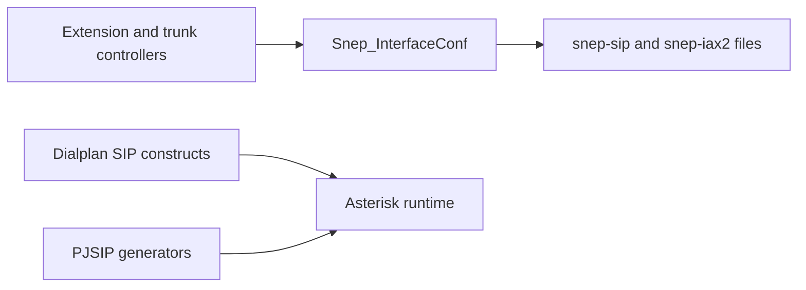
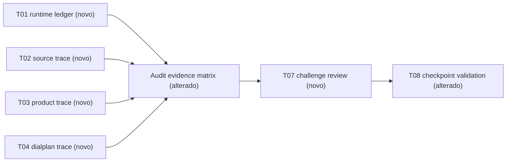

# Implementation Plan

## Request Summary

- Objective: close the TASK-0028 evidence checkpoint and determine precisely what prevents genuinely PJSIP-only architecture.
- Scope: read-only discovery, runtime evidence, source/product/API/DB trace, adversarial review, audit-document update, and final validation. Out: application/config/database changes, module/path removal, TASK-0028A/B/C execution, commits, and `.nexus/` writes.
- Tier: complete
- Architecture references: `AGENTS.md`, `CLAUDE.md`, `docs/tasks/0028-pjsip-only-architecture-audit.md`

## A. Current evidence accepted as complete

- Asterisk 22.11.0; `chan_pjsip` and about 50 PJSIP modules loaded; `chan_sip` not loaded; `chan_iax2` installed but not loaded.
- UDP, TCP, WSS PJSIP transports active; zero endpoints and registrations at collection time.
- `app`, `asterisk`, `db`, and `provider` healthy; ODBC DSN `snep` has one active connection.
- Dialplan baseline: 44 extensions, 183 priorities, 10 contexts; confirmed `Dial(SIP/1003,...)`, callback `Channel: SIP/...`, and `SIPAddHeader(...)`.
- PJSIP artifacts and all six legacy generated artifacts exist; neither `/etc/asterisk/sip.conf` nor `/etc/asterisk/iax.conf` exists. Existence alone is not load proof.
- Existing source evidence proves PJSIP generators and reachable legacy `InterfaceConf`, UI/POST, DB, factory, and generic channel paths.

## B. Evidence gaps

1. Direct/indirect Asterisk consumption and content class for all six legacy generated files.
2. Whether realtime/alternate includes supersede a generated legacy file.
3. Active dialplan direct and variable-derived technology inventory.
4. Complete generator map: entry point, user reachability, DB source, output, reload/load behavior.
5. Visible and hidden extension/trunk creation/edit reachability including POST/AJAX/API and persisted values.
6. DB technology model/value counts and API/export compatibility.
7. Reviewer-tested reachability/disposition for every legacy item and evidence-based 2–4 follow-up grouping.

## C. Agent assignments

| Agent | Scope | Inputs | Commands/searches | Expected output |
|---|---|---|---|---|
| `qos-explore` | Repository source trace | audit doc; accepted baseline | codegraph first; section F searches | generator/file/DB/reload matrix with line references |
| `qos-runtime` | Runtime/config proof without mutation | six filenames; compose services | section E commands | module/ODBC/dialplan/include/content evidence, redacted |
| `qos-product` | Product, POST, AJAX/API, DB reachability | controller/view paths from explorer | section F and aggregate read-only DB queries | visible/hidden create/edit and compatibility matrix |
| `qos-review` | Disprove dead/PJSIP-only claims | three evidence outputs and draft matrix | indirect include, dynamic prefix/file, hidden field/route, DB/AGI search | objections and resolved/unresolved outcome |
| `qos-verify` | Final checkpoint validation | final audit document/tree | four mandatory commands | PASS/FAIL report and no-behavior-change assertion |

## D. Ordered execution graph

```text
accepted baseline
       ↓
runtime includes + generated contents ─┐
source generator trace ────────────────┼→ product/API/DB reachability
active dialplan inventory ─────────────┘              ↓
                                  architecture classification
                                                   ↓
                                         adversarial review challenge
                                                   ↓
                                           final documentation update
                                                   ↓
                                              validation checkpoint
```

`qos-explore` and `qos-runtime` are parallel-safe. Product trace follows source discovery; classification waits for all evidence; review precedes validation.

## E. Exact runtime commands

Run from the repository root. They only inspect state/content; do not run any Asterisk reload, SQL write, generator, or `sed -i` command.

```bash
docker compose ps
docker compose exec -T asterisk asterisk -rx "core show version"
docker compose exec -T asterisk asterisk -rx "module show like chan_"
docker compose exec -T asterisk asterisk -rx "pjsip show transports"
docker compose exec -T asterisk asterisk -rx "odbc show"
docker compose exec -T asterisk asterisk -rx "dialplan show" > /tmp/task-0028-dialplan-show.txt
rg -n -i 'PJSIP/|SIP/|IAX2/|SIPAddHeader|Dial\(|Channel:' /tmp/task-0028-dialplan-show.txt
docker compose exec -T asterisk sh -c 'for f in /etc/asterisk/pjsip.conf /etc/asterisk/extensions.conf /etc/asterisk/modules.conf /etc/asterisk/snep/*.conf; do [ -r "$f" ] && printf "\n### %s\n" "$f" && grep -nE "^[[:space:]]*(#include|#tryinclude|include)[[:space:]]+" "$f"; done'
docker compose exec -T asterisk sh -c 'for f in /etc/asterisk/snep/snep-sip.conf /etc/asterisk/snep/snep-sip-trunks.conf /etc/asterisk/snep/snep-sip-hints.conf /etc/asterisk/snep/snep-iax2.conf /etc/asterisk/snep/snep-iax2-trunks.conf /etc/asterisk/snep/snep-iax2-hints.conf; do printf "\n### %s\n" "$f"; [ -e "$f" ] || { echo MISSING; continue; }; wc -l "$f"; grep -nE "^\[|^[[:space:]]*#(include|tryinclude)|^[[:space:]]*;" "$f" | sed -E "s/^((secret|password|md5secret|auth_password|outbound_auth|contact|defaultuser)[[:space:]]*=[[:space:]]*).*/\1[REDACTED]/I"; done'
```

For every apparent include, recursively inspect parent includes until a known top-level Asterisk file or an absent conditional target. Record the chain, not merely a terminal filename. Capture section/count/type metadata only; do not copy raw secret, auth, registration, contact, or password values.

## F. Source audit searches

Use the index before each new source area; then use constrained first-party searches.

```bash
codegraph explore "Snep_InterfaceConf loadConfFromDb PjsipConf PjsipTrunkConf PjsipTransportConf callers generated files reload"
codegraph explore "ExtensionsController TrunksController technology extension trunk form POST API PBX_Trunks getChannelOwner DiscarRamal SIPAddHeader"
rg -n --glob '*.php' --glob '*.phtml' --glob '*.conf' 'snep-(sip|iax2)(-trunks|-hints)?\.conf|senma-pjsip(-trunks|-transports)?\.conf|InterfaceConf::loadConfFromDb|Pjsip.*Conf::loadConfFromDb' snep docker scripts
rg -n --glob '*.php' --glob '*.phtml' 'technology|pjsip_external|snepsip|snepiax2|["'"']sip["'"']|["'"']iax2["'"']|canal|channel|id_regex|peer_type' snep/modules snep/lib
rg -n --glob '*.conf' --glob '*.php' --glob '*.agi' 'SIPAddHeader|Dial\([^)]*(SIP|IAX2)|Channel:[[:space:]]*(SIP|IAX2)|\$\{(INTERFACE|CHANNEL|TECHNOLOGY)' snep/install snep/modules snep/lib
rg -n --glob '*.sh' --glob '*.php' --glob '*.sql' 'technology=(sip|iax2)|snep-(sip|iax2)|SIP/|IAX2/|pjsip' scripts snep/tests snep/modules
```

Inspect DB schema/migrations before aggregate read-only queries. Record field names and technology counts, not subscriber/provider names or credential/contact data.

## G. Evidence acceptance criteria

| Question | CONFIRMED | REFUTED | INCONCLUSIVE |
|---|---|---|---|
| Legacy file loaded | Asterisk-root include chain reaches it and relevant parser/module is loaded | reachable top-level chains exclude it or sole consumer module absent, with no alternate consumer | conditional/dynamic include or conflicting result |
| File content | redacted section/line evidence identifies endpoints, trunks, hints, headers/includes, or nothing | evidence proves another content class | content unavailable/changes during collection |
| Legacy dialplan use | active output has direct token or variable chain resolves to SIP/IAX2 | active output and all producers exclude it | variable value cannot safely be resolved |
| Generator reachability | caller, trigger, DB source, output, reload/load all linked | no caller/route/DB producer/consumer/test survives review | one link cannot be proven |
| Product path reachable | UI, accepted POST/API, persisted value, or tested route creates/edits it | validation rejects all direct/indirect paths and existing data cannot invoke it | route/authorization/payload unknown |
| Item DEAD | no product/API/DB producer, caller, generated consumer, dialplan/AGI, or test dependency and reviewer agrees | any live/hidden producer or consumer found | any required stream missing |

## H. Final documentation update plan

Update only `docs/tasks/0028-pjsip-only-architecture-audit.md`; append evidence and never replace human analysis.

| Stream | Sections to add/update |
|---|---|
| runtime/ODBC | §2: timestamp, command, redacted output summary |
| generated config | §§2 and 6: six-file include-chain/content-class matrix |
| generator/product/API/DB | §§4–5 and §§7–8: entry-point-to-DB-to-file/reload and reachability matrices |
| dialplan | §7: direct and variable-derived technology inventory with contexts |
| classification | §§3 and 10: one reachability state and disposition for every item |
| reviewer | §12: objection, proof, and resolution or bounded inconclusive result |
| validation/follow-ups | §§11–12: four gates and evidence-based task grouping |

## I. Final checkpoint template

```markdown
# TASK-0028 final checkpoint — PJSIP-only architecture audit

## Scope and immutable baseline
- Audit-only; no production behavior changed.
- Accepted runtime/ODBC/service baseline: <timestamp and command references>.

## Evidence matrix
| Domain | Legacy item | Source/runtime proof | Reachability state | Disposition | Follow-up dependency |
|---|---|---|---|---|---|

## Generated legacy configuration
| File | Include/load chain | Content class | Classification | Redaction note |
|---|---|---|---|---|

## Active dialplan and generic resolution
| Context/location | Direct or variable-built construct | Resolved technology/evidence | State | Disposition |
|---|---|---|---|---|

## Generator, database, product, and API trace
| Item | Entry point | User/API reachability | DB source/value | File/runtime effect | State |
|---|---|---|---|---|---|

## Adversarial review
| Claim challenged | Challenge | Result | Resolution |
|---|---|---|---|

## Follow-up task recommendation
1. <2–4 evidence-based tasks, dependencies, and why>

## Validation
- `make lint`: PASS/FAIL/BLOCKED with reason
- `make regression`: PASS/FAIL/BLOCKED with reason
- `git diff --check`: result
- `git status --short`: result and TASK-0028 change-scope assertion
```

## AS IS — Componentes impactados



Existing evidence verifies PJSIP and reachable legacy production paths, but not legacy generated-file consumption. Nodes are verified in the audit document and source index.

## TO BE — Componentes propostos



T01–T06 add audit evidence only, T07 independently challenges it, and T08 validates the checkpoint. No runtime configuration or application component is changed.

## Tasks

### T01 — Establish runtime and include/load ledger
- **Files**: `docs/tasks/0028-pjsip-only-architecture-audit.md`
- **Goal**: establish the effective Asterisk consumption state of each legacy generated artifact.
- **Command/file scope**: section E commands; `/etc/asterisk/{pjsip,extensions,modules}.conf` and `/etc/asterisk/snep/*.conf`, read-only.
- **Change**: `qos-runtime` records module, transport, ODBC, recursive include-chain, and six-file content/load evidence with redaction.
- **Expected evidence**: a rooted include chain, parser/module state, redacted section/count metadata, and one load/content class for every file.
- **Failure/ambiguity condition**: dynamic, conditional, or unseen top-level include; classify only as INCONCLUSIVE and identify the missing proof.
- **Covers**: RF-01, RF-02, RF-03, RNF-01, RNF-02
- **Tests**: section E commands; outputs reproducible and no reload/write command used.
- **Risk**: Medium — autoload/realtime/conditional include may create false unloaded conclusions.
- **Dependencies**: none

### T02 — Trace source generators to configuration and runtime effects
- **Files**: `docs/tasks/0028-pjsip-only-architecture-audit.md`; read-only `snep/lib/Snep/`, `snep/modules/default/controllers/`, `docker/`
- **Goal**: connect each PJSIP/SIP/IAX2 output file to its actual source producer and runtime behavior.
- **Command/file scope**: section F index/search commands; generator classes, controllers, Docker entrypoint, and tests.
- **Change**: `qos-explore` maps entry point, callers, user reachability, DB fields/query, output file, reload/load effect, and test reference.
- **Expected evidence**: one complete generator row for each `senma-pjsip*`, `snep-sip*`, and `snep-iax2*` family.
- **Failure/ambiguity condition**: output is constructed indirectly or a caller/DB query is unresolved; preserve the unproven link explicitly.
- **Covers**: RF-05, RF-07
- **Tests**: section F searches; every family has five trace fields or bounded gap.
- **Risk**: High — unconditional regeneration obscures per-tech ownership.
- **Dependencies**: none

### T03 — Audit product, API, and database technology reachability
- **Files**: `docs/tasks/0028-pjsip-only-architecture-audit.md`; read-only `snep/modules/default/`, `snep/lib/PBX/`, schema/test files
- **Goal**: determine whether a user, payload, API, or stored row can create or edit legacy technology.
- **Command/file scope**: section F controller/view/API searches and aggregate read-only DB queries after schema inspection.
- **Change**: `qos-product` records visible selector, hidden/direct POST, AJAX/API/export, DB technology field/count, and read-compatibility paths.
- **Expected evidence**: reachability matrix for SIP/IAX2 extensions/trunks, including validation result and compatibility consumers.
- **Failure/ambiguity condition**: authorization/payload contract or live DB value cannot be safely established; mark the branch INCONCLUSIVE, never DEAD.
- **Covers**: RF-06, RF-07
- **Tests**: section F plus aggregate DB read; each SIP/IAX2 extension/trunk path classified or bounded.
- **Risk**: High — hidden payload compatibility may differ from visible UI.
- **Dependencies**: T02

### T04 — Classify active dialplan and generic channel construction
- **Files**: `docs/tasks/0028-pjsip-only-architecture-audit.md`; read-only `snep/install/etc/asterisk/`, action/AGI code, dialplan output
- **Goal**: separate active direct legacy channel calls from generic constructions that may resolve to legacy technology.
- **Command/file scope**: section E `dialplan show` capture/filter plus section F dialplan/action/AGI searches.
- **Change**: map active direct SIP/IAX2/PJSIP operations and generic `canal`/`channel`/`id_regex` producers.
- **Expected evidence**: context/location, direct or variable-built construct, resolved technology/source, and state for every match.
- **Failure/ambiguity condition**: variable or AGI result cannot be resolved read-only; record bounded INCONCLUSIVE with its producer.
- **Covers**: RF-04, RF-07
- **Tests**: exact section E dialplan command and host filter; variable source lines/fields documented.
- **Risk**: High — inactive templates/dynamic AGI can be mistaken for active behavior.
- **Dependencies**: T01, T02

### T05 — Build finite architecture classification and follow-up grouping
- **Files**: `docs/tasks/0028-pjsip-only-architecture-audit.md`
- **Goal**: turn evidence into a complete legacy inventory and a small ordered migration backlog.
- **Command/file scope**: collected matrices and the audit document only; no source/config changes.
- **Change**: synthesize seven domains into one inventory with one reachability state and allowed disposition; recommend 2–4 dependency-ordered follow-ups only.
- **Expected evidence**: every item has source/runtime proof, state, allowed disposition, and follow-up dependency or explicit reason.
- **Failure/ambiguity condition**: any stream is incomplete or disputes an item; retain it as INCONCLUSIVE and block a `DEAD_DELETE` conclusion.
- **Covers**: RF-07, RF-10
- **Tests**: compare inventory to all evidence lists; reject “probably unused” without allowed disposition.
- **Risk**: High — missing proof could be mistaken for dead code.
- **Dependencies**: T01, T02, T03, T04

### T06 — Record audit evidence without changing human analysis
- **Files**: `docs/tasks/0028-pjsip-only-architecture-audit.md`
- **Goal**: preserve the human-authored audit while adding reproducible closure evidence.
- **Command/file scope**: append-only additions in sections named in H; inspect diff only.
- **Change**: append matrices/checkpoint material; preserve authored text and do not touch `.nexus/`.
- **Expected evidence**: a document diff containing redacted evidence, classifications, review status, and follow-up recommendation.
- **Failure/ambiguity condition**: a result needs a secret or requires rewriting authored text; omit/redact it and record the limitation.
- **Covers**: RF-03, RF-10, RNF-02, RNF-03
- **Tests**: diff review; only added audit evidence and no secret.
- **Risk**: Medium — accidental overwrite or secret disclosure.
- **Dependencies**: T05

### T07 — Conduct adversarial review of dead and PJSIP-only claims
- **Files**: `docs/tasks/0028-pjsip-only-architecture-audit.md`; read-only repository/runtime scopes
- **Goal**: falsify conclusions before any future removal work relies on them.
- **Command/file scope**: source index/search plus recursive include, dynamic naming, hidden route/input, DB, and AGI checks.
- **Change**: `qos-review` challenges indirect includes, dynamic construction, hidden fields/routes, DB, and AGI claims; records outcomes.
- **Expected evidence**: an objection ledger that covers every `DEAD`, `GENERATED_BUT_NOT_LOADED`, and PJSIP-only claim.
- **Failure/ambiguity condition**: reviewer finds a producer/consumer or cannot disprove a dynamic path; revise state/disposition or preserve INCONCLUSIVE.
- **Covers**: RF-08
- **Tests**: every `DEAD`/unloaded item has reviewer outcome; unresolved means INCONCLUSIVE.
- **Risk**: High — confirmation bias could authorize unsafe removal.
- **Dependencies**: T06

### T08 — Validate audit-only checkpoint
- **Files**: `docs/tasks/0028-pjsip-only-architecture-audit.md`
- **Goal**: demonstrate the evidence checkpoint is reproducible and made no production change.
- **Command/file scope**: `make lint`, `make regression`, `git diff --check`, `git status --short`.
- **Change**: `qos-verify` records required gates and scope assertion; fixes nothing.
- **Expected evidence**: four exact command outcomes and a change-scope statement.
- **Failure/ambiguity condition**: a command fails/blocks or unrelated dirt cannot be attributed; report it verbatim and do not repair/clean it.
- **Covers**: RF-09, RNF-03
- **Tests**: `make lint`; `make regression`; `git diff --check`; `git status --short`.
- **Risk**: Medium — dirty pre-existing tree needs attribution, not cleanup.
- **Dependencies**: T07

## Execution Phases

| Phase | Tasks | Parallel-safe? |
|---|---|---|
| 1 — Independent evidence collection | T01, T02 | Yes |
| 2 — Product and active-dialplan trace | T03, T04 | T03 after T02; T04 after T01/T02 |
| 3 — Classification and documentation | T05, T06 | No |
| 4 — Independent challenge | T07 | No |
| 5 — Final validation | T08 | No |

## Risks

| Risk | Blast radius | Mitigation | Rollback |
|---|---|---|---|
| `Dial(SIP/...)`, spool `Channel: SIP/...`, `SIPAddHeader` | calls, callbacks, signaling | classify active instances and only describe PJSIP targets for later work | no behavior change |
| legacy generated SIP/IAX files | ownership/later deletion | prove include chain and redacted content before disposition | remove audit prose only |
| reachable UI/POST/data branches | migration/data integrity | distinguish visible, hidden, data-driven reachability | no branch change |
| generic resolution | inbound/outbound routing | trace `canal`, `channel`, `id_regex`, technology | defer unresolved conclusion |
| dirty worktree | checkpoint credibility | report status, never clean/attribute guesses | none |

## Open Questions

- An untracked top-level include outside the inspected Asterisk roots must be found before declaring a file unloaded; this is an evidence gap, not authorization to modify Asterisk.

## Assumptions

- User-supplied runtime and ODBC evidence remains accepted unless contradicted.
- Retain TASK-0028A/B/C names only if the finite inventory supports their boundaries; otherwise recommend 2–4 clearer tasks.
- No formal API contract is emitted: this audits existing compatibility and introduces no API surface.

## TO BE

TASK-0028 remains audit-only. No production implementation is authorized.
