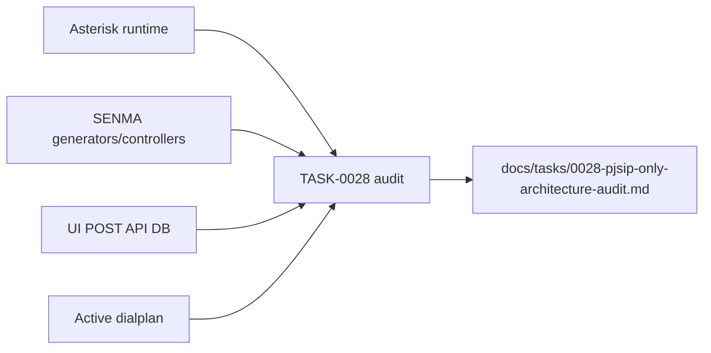
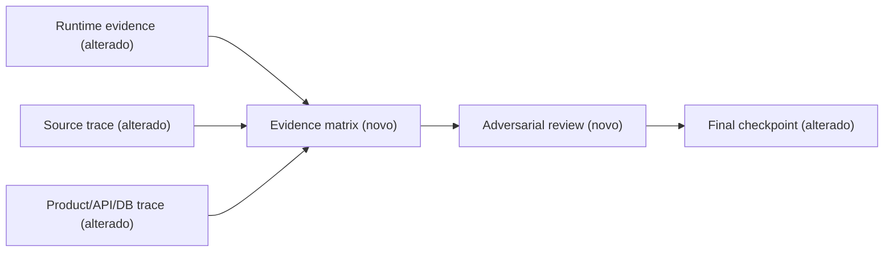

# SPEC: TASK-0028 PJSIP-Only Architecture Audit

## Metadata

- Version: 1.0
- Tier: complete
- Architecture references: `AGENTS.md`, `CLAUDE.md`, `docs/tasks/0028-pjsip-only-architecture-audit.md`
- Architecture rule: repository and runtime evidence take precedence over assumptions; this task writes audit evidence only and must not change PBX behavior.

## RIGID

### Functional requirements

- RF-01: When the audit begins, the audit team shall accept the supplied Asterisk 22.11.0 module, PJSIP transport, healthy-service, ODBC, and baseline dialplan evidence without recollecting it unless a later result contradicts it.
- RF-02: When inspecting each of the six legacy generated files, the audit team shall establish its direct or indirect Asterisk include/load relationship and classify it as `GENERATED_AND_LOADED`, `GENERATED_BUT_NOT_LOADED`, `EMPTY_PLACEHOLDER`, or `ORPHANED`.
- RF-03: When inspecting a legacy generated file, the audit team shall classify its effective content as real endpoints, real trunks, real hints, headers/includes only, or nothing, while redacting credential-bearing values.
- RF-04: When inspecting the active dialplan, the audit team shall use `docker compose exec asterisk asterisk -rx "dialplan show"` and host-side filtering to inventory `PJSIP/`, `SIP/`, `IAX2/`, `SIPAddHeader`, and variable-built channel/interface values that can resolve to SIP or IAX2.
- RF-05: When tracing configuration production, the audit team shall record for every `senma-pjsip*.conf`, `snep-sip*.conf`, and `snep-iax2*.conf` generator its entry point, user reachability, DB source, output file, and reload/load behavior.
- RF-06: When tracing product reachability, the audit team shall determine whether UI, direct POST, API/AJAX, persisted DB values, or generic channel resolution can create or edit SIP and IAX2 extensions and trunks.
- RF-07: When evidence is assembled, the audit team shall assign every identified legacy item one reachability state (`LIVE_REACHABLE`, `LIVE_BUT_BROKEN`, `HIDDEN_REACHABLE`, `GENERATED_BUT_UNUSED`, `DEAD`) and one allowed disposition.
- RF-08: Before closure, an independent reviewer shall attempt to refute every `DEAD`, unloaded-file, and PJSIP-only assertion through indirect includes, dynamic names/prefixes, hidden input, old route, DB-driven, and AGI resolution checks.
- RF-09: At final validation, the verifier shall run `make lint`, `make regression`, `git diff --check`, and `git status --short`; one full regression PASS is sufficient and validation must show no application behavior changed by TASK-0028.
- RF-10: At checkpoint, the report shall group evidence into Asterisk runtime, application product surface, config generation, dialplan, database model, API, and test coverage, and recommend 2–4 evidence-based follow-up tasks without starting them.

### Non-functional requirements

- RNF-01: All runtime and database commands are read-only and must not reload Asterisk, alter configuration, or mutate database rows.
- RNF-02: Documentation must not record secrets; content evidence uses section/count/type metadata and redacts password, secret, auth, and registration values.
- RNF-03: TASK-0028 must not remove chan_sip/IAX2 paths or implement TASK-0028A/B/C.

## FLEXIBLE

- Executors may select compact tables and redacted excerpts when each classification remains reproducible.
- Reviewers may add newly discovered legacy items before final classification.

## AS IS — Evidence flow

The audit already identifies reachable legacy paths, but lacks the runtime consumption and active-dialplan evidence needed for a finite checkpoint.

## TO BE — Evidence closure flow

T01–T06 establish the reproducible matrix, T07 challenges it, and T08 validates it. No production component is changed.

## Acceptance Criteria

1. All six legacy generated files have a direct evidence-backed load classification and redacted content classification.
2. The active dialplan legacy technology inventory includes direct and generic variable-based construction, or records a bounded inconclusive condition.
3. Every legacy generator and reachable extension/trunk product path has the required trace fields.
4. The final document contains a finite reachability state and allowed disposition for every legacy item across all seven architecture domains.
5. Reviewer objections are recorded and resolved, and final validation reports the four required commands with no application-code change attributable to TASK-0028.

## TO BE

TASK-0028 is audit-only. It authorizes evidence collection and updates to its audit document only; it authorizes no production implementation, path removal, config reload, data mutation, commit, or start of follow-up tasks.
